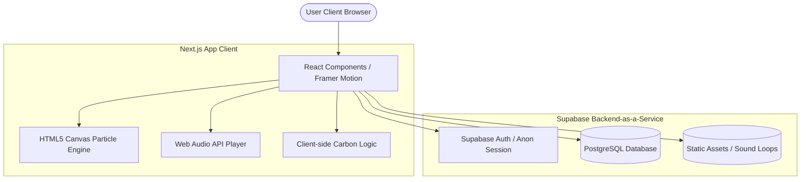

# Product Requirements Document (PRD): EcoVisual

## 1. Executive Summary

### 1.1 Vision
EcoVisual is a web application designed to gamify personal sustainability by translating abstract carbon metrics into an immersive, real-time, audio-visual digital ecosystem. Instead of presenting carbon footprints as dry data points, isolated statistics, or generic dashboard charts, EcoVisual uses generative design to make a user's environmental impact tangible, visceral, and emotionally resonant.

### 1.2 Product Goal
The primary objective of EcoVisual is to empower individuals to track, understand, and reduce their daily carbon footprint. By combining an intuitive logging system, a dynamic environmental display, personalized actionable insights, and community-driven education, EcoVisual cultivates long-term, sustainable behavioral changes.

### 1.3 Key Differentiator: The Dynamic Environmental Engine
While traditional sustainability apps rely on static dashboards, EcoVisual introduces a live visual/audio feedback loop. The entire visual theme, atmospheric particle system, and ambient soundscape of the application morph dynamically in response to the user's daily carbon score, reinforcing positive environmental choices and visualizing the consequences of carbon-heavy activities in real-time.

---

## 2. Problem Statement

### 2.1 The Abstraction of Carbon Metrics
Carbon footprints are measured in metric units (grams or kilograms of CO2e) that the average consumer cannot easily conceptualize. Knowing that a meal cost "3.2 kg CO2e" or a commute generated "8.5 kg CO2e" lacks emotional meaning and fails to convey the scale of individual contribution to global warming.

### 2.2 Friction in Tracking and Logging
Existing carbon accounting tools require exhaustive, historical utility data or long-form onboarding surveys. This creates high entry friction. The lack of a simple, friction-free daily tracker leads to low retention and prevents users from forming a habit of logging and reflecting on their daily choices.

### 2.3 The "Eco-Fatigue" and Lack of Engagement
Environmental awareness campaigns and apps often rely on guilt or doom-scrolling, leading to emotional fatigue. EcoVisual replaces this negative reinforcement with a gamified, visual progression where users are directly rewarded with a beautiful, serene digital environment for making climate-positive choices.

---

## 3. Target Audience

### 3.1 Primary Persona: The Conscious Eco-Explorer (Gen-Z & Millennials)
- **Demographics:** Age 18–35, urban, tech-savvy.
- **Psychographics:** Highly concerned about climate change, active on social media, values aesthetics and digital design, eager to reduce their impact but feels overwhelmed by where to start.
- **Pain Points:** Wants quick, actionable tips; finds current climate apps boring or depressing; wants to see immediate visual proof of progress.

### 3.2 Secondary Persona: The Optimizing Remote Worker
- **Demographics:** Age 25–45, works from home, has high control over household energy and daily diet.
- **Psychographics:** Tech-oriented, data-driven, enjoys tracking daily habits (like steps or sleep), looks for marginal gains in personal efficiency.
- **Pain Points:** Struggles to estimate home energy usage and the carbon impact of food delivery vs. home cooking.

---

## 4. Functional Requirements

### 4.1 Dynamic Environmental Engine (Core USP)
The engine reads the user's daily net carbon score, compares it to a calculated daily "carbon budget," and changes the application's appearance and soundscape.

- **Score Normalization:**
  Let $C_{daily}$ be the sum of logged emissions for the current day, and $B_{user}$ be the user's targeted daily carbon budget (calculated during setup, e.g., 10 kg CO2e/day).
  The Carbon Ratio $R$ is calculated as:
  \[R = \frac{C_{daily}}{B_{user}}\]
- **Environmental State Thresholds:**
  - **Eco-Warrior State ($R \le 0.60$):** The user is well below budget.
  - **Average State ($0.60 < R \le 1.00$):** The user is within budget but approaching the limit.
  - **Critical State ($R > 1.00$):** The user has exceeded their daily budget.

- **Dynamic Visuals:**
  - **Colors & Themes:** Uses CSS custom variables injected into the DOM based on state.
  - **Particle Systems:** Generates custom-rendered HTML5 Canvas or WebGL particle effects matching the state (e.g., green leaves, drifting white clouds, grey/black ash and smog particles).
- **Dynamic Audio:**
  - Synthesizes or loops high-quality ambient soundscapes that adjust pitch, layer volume, and filter cutoff based on the Carbon Ratio $R$.

### 4.2 Daily Carbon Calculator
A fast, intuitive input system that allows logging within 10 seconds.

- **Quick-Add Interface:**
  - A modal with four core logging cards: Transportation, Diet, Energy, and Shopping.
  - Value-sliders and single-tap buttons for rapid entry.
- **Logging Categories & Math Model (CO2e conversion):**
  - **Transportation:** Commute mode (Petrol Car, Electric Car, Hybrid, Public Transit, Bicycle/Walk) * Distance (km).
  - **Diet:** Main protein source (Beef, Pork, Poultry, Fish, Dairy/Vegetarian, Vegan) * Servings.
  - **Energy:** Appliance usage (Heating, AC, Laundry, Electronics) * Hours of use.
  - **Shopping:** Consumption category (Fast Fashion, Electronics, General Goods, Single-Use Plastics).
- **Lookup Tables:**
  The calculator uses a local conversion lookup table (standardized from EPA, DEFRA, and IPPC values) to compute kg CO2e instantly client-side.

### 4.3 Personalized Daily Guide
An automated advice engine that acts as a personal sustainability coach.

- **Daily Recommendations:**
  - Every morning, the application parses the previous day's log.
  - It identifies the category with the highest emission share.
  - It presents 3 specific, checkable tasks to mitigate that specific category today.
- **Interactive Checklist:**
  - Completing a task deducts a predefined "virtual carbon offset" from the current day's total score, helping the user return to an "Eco-Warrior" state.
  - Tooltips explain the mathematical impact of each action.

### 4.4 Education Hub
A micro-learning interface to counter misinformation and eco-fatigue.

- **Content Delivery:**
  - Grid card layout with bite-sized cards (read time under 45 seconds).
  - Categorized into "Dietary Swaps", "Home Efficiency", and "Green Commuting".
- **Contextual Hook Engine:**
  - If a user inputs "Beef" in the calculator, a small notification badge links to a micro-learning card: *"Did you know? Swapping beef for chicken once a week reduces your food carbon footprint by 45%."*

### 4.5 User Progress & Gamification
Visual reinforcement of long-term habit formation.

- **Dashboard Charts:**
  - **30-Day Trend:** A smooth line chart displaying daily CO2e compared to the user's budget line.
  - **Category Breakdown:** A donut chart showing percentage allocation of carbon emissions.
- **Badge Engine:**
  - Achievements unlocked upon meeting streak thresholds (e.g., "Solar Powered" for 5 days of zero electricity waste, "Forest Keeper" for maintaining the Eco-Warrior state for 7 consecutive days).
- **User Profiles:**
  - Secure profile to save historical logs, set regional carbon intensity factors (based on local electricity grid averages), and toggle audio preferences.

---

## 5. User Stories

| ID | As a... | I want to... | So that... |
| :--- | :--- | :--- | :--- |
| **US-01** | App User | Tap on quick-log options for my daily travel | I can input my commute in less than 5 seconds without typing numbers. |
| **US-02** | Conscious Consumer | See the app theme transition instantly from grey to green when I check a completed green action | I experience immediate positive reinforcement for my sustainable choice. |
| **US-03** | Remote Worker | Select my specific geographic region in my profile | The carbon calculator accurately weights my home electricity consumption based on my local grid's fossil fuel mix. |
| **US-04** | Competitive User | Earn streak badges and see a calendar of past "Eco-Warrior" days | I feel motivated to log my data daily and maintain a climate-positive lifestyle. |
| **US-05** | Privacy Advocate | Choose to bypass email sign-up and use the application in "Anonymous Mode" | I can track my footprint without risking the exposure of my personal habits or location data. |

---

## 6. UI/UX Specifications

### 6.1 State Transition Matrix

The table below outlines the visual, acoustic, and environmental parameters for each of the three core user states.

| Parameter | Eco-Warrior ($R \le 0.60$) | Average ($0.60 < R \le 1.00$) | Critical ($R > 1.00$) |
| :--- | :--- | :--- | :--- |
| **Theme Primary** | Emerald Green (#10B981) | Slate Blue (#64748B) | Crimson Red (#EF4444) |
| **Background** | Lush green-to-blue soft gradient | Muted, overcast gray-blue gradient | Dark charcoal-to-toxic-orange gradient |
| **Canvas Particle Effect** | Soft green leaves and flower petals drifting across screen. High float, low speed. | Semi-transparent white clouds slowly moving across the header. | Dense, dark gray soot and smoke particles moving rapidly with turbulent vectors. |
| **Particle Count** | 30–50 particles | 10–15 cloud clusters | 120–150 particles |
| **Soundscape** | Forest birds chirping, gentle wind through trees, soft stream water. | Light rain, distant rustling, neutral white noise. | Low industrial hum, mechanical drone, harsh wind gusts. |
| **Audio Controls** | Crossfades smoothly over 3 seconds when state changes; manual play/pause and volume slider in header. |

### 6.2 Key Screen Mockup Descriptions

1. **Dashboard Home:**
   - **Visual Atmosphere:** The full-screen background reflects the current state. A frosted-glass container card (glassmorphism) floats in the center.
   - **State Indicator:** A large central gauge displays the current daily CO2e (e.g., "4.2 / 10.0 kg CO2e") with a dynamic ring indicator matching the state's theme color.
   - **Audio Toggle:** Located in the top right corner, a floating toggle icon showing a speaker with waves (active) or a slash (muted).
2. **Quick-Add Calculator Modal:**
   - **Design:** Slides up from the bottom with a spring animation. Four tabs with minimal icons (Car, Plate, Bulb, Tag).
   - **Interactivity:** Dragging the transport slider displays the calculated CO2e dynamic feedback immediately (e.g., "12 km by Gas Car = 2.4 kg CO2e").

---

## 7. Technical Architecture

### 7.1 Tech Stack
- **Framework:** Next.js (React 19) App Router for efficient static pages and dynamic dashboard rendering.
- **Styling & Animation:** Tailwind CSS for rapid responsive layouts; Framer Motion for spring physics on modals, tab transitions, and gauge calculations.
- **Visual Effects:** 2D Context HTML5 Canvas API (custom lightweight script) for low-overhead particle simulation.
- **Audio Processing:** Web Audio API for managing audio nodes, gain nodes (volume), and linear ramp crossfading between loops.
- **Backend & Database:** Supabase (PostgreSQL) for user account management, daily log tables, badge storage, and asset CDN.

### 7.2 Database Schema (Entity Relationship)

#### Table: `profiles`
- `id`: uuid (Primary Key, references auth.users)
- `created_at`: timestamp
- `grid_region`: varchar (e.g., 'US-EAST', 'EU-CENTRAL')
- `daily_budget`: numeric (default: 10.0)
- `anonymous`: boolean (default: false)

#### Table: `daily_logs`
- `id`: uuid (Primary Key)
- `user_id`: uuid (Foreign Key, references profiles.id)
- `log_date`: date (Unique constraint per user per date)
- `transport_co2e`: numeric (kg CO2e)
- `diet_co2e`: numeric (kg CO2e)
- `energy_co2e`: numeric (kg CO2e)
- `shopping_co2e`: numeric (kg CO2e)
- `total_co2e`: numeric (calculated field or updated on write)

#### Table: `completed_actions`
- `id`: uuid (Primary Key)
- `user_id`: uuid (Foreign Key)
- `action_date`: date
- `action_key`: varchar (references pre-defined action impact lookup)
- `offset_value`: numeric (kg CO2e)

---

## 8. Success Metrics (KPIs)

### 8.1 User Engagement & Retention
- **Log Frequency:** Average number of logs entered per user per week (Target: $\ge 4.5$).
- **Daily Soundscape Engagement:** Percentage of users who keep environmental audio unmuted for $\ge 2$ minutes (Target: $\ge 40\%$).
- **Visual Progression Rate:** Percentage of users who transition from a "Critical" or "Average" state to "Eco-Warrior" within a 7-day tracking cycle.

### 8.2 Technical Performance
- **Core Web Vitals:**
  - **Lighthouse Performance Score:** $\ge 90$ on both desktop and mobile.
  - **Largest Contentful Paint (LCP):** $< 2.5$ seconds.
  - **First Contentful Paint (FCP):** $< 1.2$ seconds.
- **Dynamic Assets Performance:** Particle engines and audio files must use lazy-loading and Web Workers (if needed) to maintain 60 FPS visual rendering.

### 8.3 Environmental Impact
- **Average Footprint Reduction:** Cumulative drop in daily average CO2e logged per user after 30 days of active app usage (Target: $10\%$ average reduction).

---

## 9. Roadmap Phases

### Phase 1: MVP (Minimum Viable Product)
- **Core Mechanics:** Simple 10-second Daily Calculator with manual input.
- **Visuals:** CSS Variable-based theme switching (3 basic colors and gradients).
- **Data:** Local-storage based tracking and local lookup formulas. Anonymous usage only.
- **Guide:** 3 static daily tips based on the highest category.

### Phase 2: Immersive Visuals & Cloud Sync (Target Release: Q3)
- **Atmospheric Visuals:** HTML5 Canvas particle systems (leaves, clouds, smog) running at 60fps.
- **Ambient Audio:** Audio loop player utilizing Web Audio API with smooth transition crossfading.
- **Cloud Backend:** Supabase Auth and PostgreSQL storage enabling multi-device sync, data export, and historical profiles.
- **Gamification:** Achievement badge engine with trigger listeners.

### Phase 3: Automation & Ecosystem (Target Release: Q4)
- **Auto-Tracking Integrations:** Connect to smart meters (e.g., Nest, ecobee) and public transit APIs.
- **Community Engine:** Global challenges, shared carbon pools, and comparative dashboards.
- **Advanced Gamification:** Virtual garden that grows/wears down based on weekly carbon streaks.
